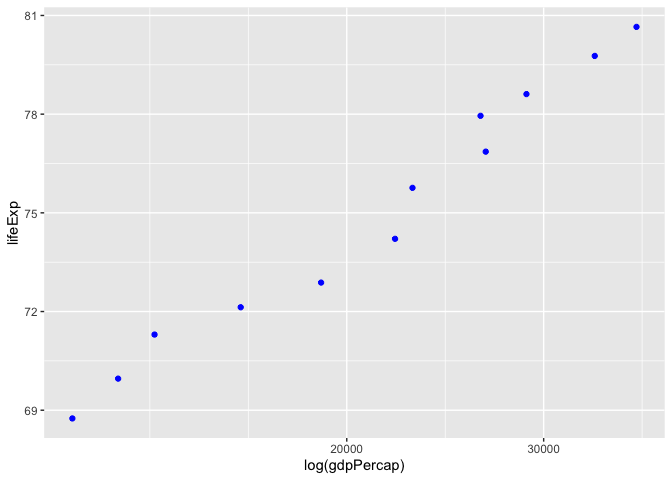
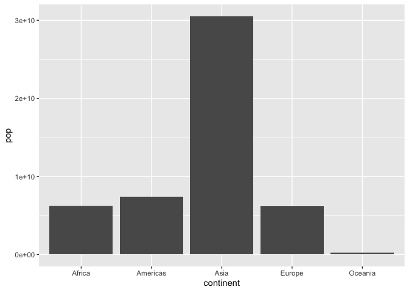
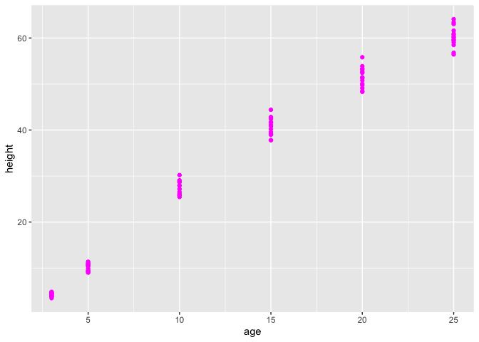
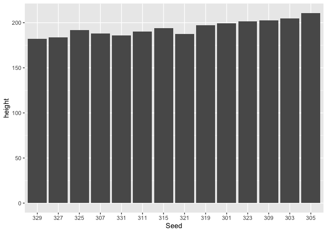

---
title: "hw02_dplyr"
output: 
 html_document:
    keep_md: true
---    
    


Load tidyverse, gapminder, and datasets:


```r
library(tidyverse)
library(gapminder)
library(datasets)
```

## 1.1

Gapminder dataset filtered for data in only the 1970's:

```r
DT::datatable(gapminder %>%
  filter(year == 1970:1979))
```

<!--html_preserve--><div id="htmlwidget-ae98ac5595b22952140f" style="width:100%;height:auto;" class="datatables html-widget"></div>
<script type="application/json" data-for="htmlwidget-ae98ac5595b22952140f">{"x":{"filter":"none","data":[["1","2","3","4","5","6","7","8","9","10","11","12","13","14","15","16","17","18","19","20","21","22","23","24","25","26","27","28","29","30","31","32","33","34","35","36","37","38","39","40","41","42","43","44","45","46","47","48","49","50","51","52","53","54","55","56","57"],["Albania","Argentina","Austria","Belgium","Bolivia","Brazil","Burkina Faso","Cameroon","Central African Republic","China","Comoros","Costa Rica","Croatia","Denmark","Dominican Republic","El Salvador","Eritrea","France","Gambia","Greece","Guinea","Honduras","Hungary","Indonesia","Iraq","Italy","Japan","Korea, Dem. Rep.","Kuwait","Liberia","Madagascar","Mali","Mauritius","Montenegro","Mozambique","Nepal","New Zealand","Nigeria","Oman","Paraguay","Philippines","Puerto Rico","Romania","Saudi Arabia","Serbia","Slovak Republic","Somalia","Sri Lanka","Swaziland","Syria","Tanzania","Trinidad and Tobago","Turkey","United States","Venezuela","Yemen, Rep.","Zimbabwe"],["Europe","Americas","Europe","Europe","Americas","Americas","Africa","Africa","Africa","Asia","Africa","Americas","Europe","Europe","Americas","Americas","Africa","Europe","Africa","Europe","Africa","Americas","Europe","Asia","Asia","Europe","Asia","Asia","Asia","Africa","Africa","Africa","Africa","Europe","Africa","Asia","Oceania","Africa","Asia","Americas","Asia","Americas","Europe","Asia","Europe","Europe","Africa","Asia","Africa","Asia","Africa","Americas","Europe","Americas","Americas","Asia","Africa"],[1977,1972,1977,1972,1977,1972,1977,1972,1977,1972,1977,1972,1977,1972,1977,1972,1977,1972,1977,1972,1977,1972,1977,1972,1977,1972,1977,1972,1977,1972,1977,1972,1977,1972,1977,1972,1977,1972,1977,1972,1977,1972,1977,1972,1977,1972,1977,1972,1977,1972,1977,1972,1977,1972,1977,1972,1977],[68.93,67.065,72.17,71.44,50.023,59.504,46.137,47.049,46.775,63.11888,50.939,67.849,70.64,73.47,61.788,58.207,44.535,72.38,41.842,72.34,40.762,53.884,69.95,49.203,60.413,72.19,75.38,63.983,69.343,42.614,46.881,39.977,64.93,70.636,42.495,43.971,72.22,42.821,57.367,65.815,60.06,72.16,69.46,53.886,70.3,70.35,41.974,65.042,52.537,57.296,49.919,65.9,59.507,71.34,67.456,39.848,57.674],[2509048,24779799,7568430,9709100,5079716,100840058,5889574,7021028,2167533,862030000,304739,1834796,4318673,4991596,5302800,3790903,2512642,51732000,608274,8888628,4227026,2965146,10637171,121282000,11882916,54365564,113872473,14781241,1140357,1482628,8007166,5828158,913025,527678,11127868,12412593,3164900,53740085,1004533,2614104,46850962,2847132,21658597,6472756,8686367,4593433,4353666,13016733,551425,6701172,17129565,975199,42404033,209896000,13503563,7407075,6642107],[3533.00391,9443.038526,19749.4223,16672.14356,3548.097832,4985.711467,743.3870368,1684.146528,1109.374338,676.9000921,1172.603047,5118.146939,11305.38517,18866.20721,2681.9889,4520.246008,505.7538077,16107.19171,884.7552507,12724.82957,874.6858643,2529.842345,11674.83737,1111.107907,14688.23507,12269.27378,16610.37701,3701.621503,59265.47714,803.0054535,1544.228586,581.3688761,3710.982963,7778.414017,502.3197334,674.7881296,16233.7177,1698.388838,11848.34392,2523.337977,2373.204287,9123.041742,9356.39724,24837.42865,12980.66956,9674.167626,1450.992513,1213.39553,3781.410618,2571.423014,962.4922932,6619.551419,4269.122326,21806.03594,13143.95095,1265.047031,685.5876821]],"container":"<table class=\"display\">\n  <thead>\n    <tr>\n      <th> <\/th>\n      <th>country<\/th>\n      <th>continent<\/th>\n      <th>year<\/th>\n      <th>lifeExp<\/th>\n      <th>pop<\/th>\n      <th>gdpPercap<\/th>\n    <\/tr>\n  <\/thead>\n<\/table>","options":{"columnDefs":[{"className":"dt-right","targets":[3,4,5,6]},{"orderable":false,"targets":0}],"order":[],"autoWidth":false,"orderClasses":false}},"evals":[],"jsHooks":[]}</script><!--/html_preserve-->

3 countries picked from the filtered results and refiltered for Greece, Austria, and Philippines within the 1970's.  A new table 'gapminder1.1' is made:

```r
gapminder1.1 <- (gapminder %>%
  filter(country == 'Greece' | country == 'Austria' | country == 'Philippines', year == 1970:1979))
knitr::kable(gapminder1.1)
```


country       continent    year   lifeExp        pop   gdpPercap
------------  ----------  -----  --------  ---------  ----------
Austria       Europe       1977     72.17    7568430   19749.422
Greece        Europe       1972     72.34    8888628   12724.830
Philippines   Asia         1977     60.06   46850962    2373.204

## 1.2 

Variables country and gdpPercap only shown from gapminder1.1:

```r
knitr::kable(gapminder1.1 %>%
  select(country, gdpPercap))
```


country        gdpPercap
------------  ----------
Austria        19749.422
Greece         12724.830
Philippines     2373.204

## 1.3

To filter gapminder to all rows that have a drop in life expectancy a new temporary variable of countrylag containing country values shifted one row down is made.
A new variable of increase in life expectancy is made from the difference in life expectancy between each year in order of country and year. Country and countrylag values are compared.  If they are not equal then its value is replaced with 0.  Increase in life expectancy is filtered for drop in life expectancy by filtering for negative values only. Countrylag is removed from the table.


```r
DT::datatable(gapminder %>%
  mutate(countrylag = lag(country, order_by = country & year)) %>%
  mutate(increaseLifeExp = lag(diff(gapminder$lifeExp), order_by = country & year)) %>%
  mutate(increaseLifeExp = if_else( country == countrylag, increaseLifeExp, 0)) %>%
  filter(increaseLifeExp < 0) %>%
  select(-countrylag))
```

<!--html_preserve--><div id="htmlwidget-6811985dda7c394700db" style="width:100%;height:auto;" class="datatables html-widget"></div>
<script type="application/json" data-for="htmlwidget-6811985dda7c394700db">{"x":{"filter":"none","data":[["1","2","3","4","5","6","7","8","9","10","11","12","13","14","15","16","17","18","19","20","21","22","23","24","25","26","27","28","29","30","31","32","33","34","35","36","37","38","39","40","41","42","43","44","45","46","47","48","49","50","51","52","53","54","55","56","57","58","59","60","61","62","63","64","65","66","67","68","69","70","71","72","73","74","75","76","77","78","79","80","81","82","83","84","85","86","87","88","89","90","91","92","93","94","95","96","97","98","99","100","101","102"],["Albania","Angola","Benin","Botswana","Botswana","Botswana","Bulgaria","Bulgaria","Bulgaria","Burundi","Cambodia","Cambodia","Cameroon","Cameroon","Cameroon","Central African Republic","Central African Republic","Central African Republic","Chad","Chad","China","Congo, Dem. Rep.","Congo, Dem. Rep.","Congo, Dem. Rep.","Congo, Dem. Rep.","Congo, Rep.","Congo, Rep.","Cote d'Ivoire","Cote d'Ivoire","Cote d'Ivoire","Croatia","Czech Republic","Denmark","El Salvador","El Salvador","Eritrea","Gabon","Gabon","Gabon","Ghana","Hungary","Hungary","Iraq","Iraq","Iraq","Jamaica","Jamaica","Kenya","Kenya","Kenya","Korea, Dem. Rep.","Korea, Dem. Rep.","Korea, Dem. Rep.","Lesotho","Lesotho","Lesotho","Liberia","Malawi","Malawi","Montenegro","Mozambique","Mozambique","Myanmar","Namibia","Namibia","Netherlands","Nigeria","Nigeria","Norway","Poland","Poland","Puerto Rico","Romania","Romania","Rwanda","Rwanda","Serbia","Sierra Leone","Slovak Republic","Somalia","South Africa","South Africa","South Africa","Swaziland","Swaziland","Swaziland","Tanzania","Tanzania","Togo","Trinidad and Tobago","Trinidad and Tobago","Uganda","Uganda","Uganda","Uganda","Zambia","Zambia","Zambia","Zambia","Zimbabwe","Zimbabwe","Zimbabwe"],["Europe","Africa","Africa","Africa","Africa","Africa","Europe","Europe","Europe","Africa","Asia","Asia","Africa","Africa","Africa","Africa","Africa","Africa","Africa","Africa","Asia","Africa","Africa","Africa","Africa","Africa","Africa","Africa","Africa","Africa","Europe","Europe","Europe","Americas","Americas","Africa","Africa","Africa","Africa","Africa","Europe","Europe","Asia","Asia","Asia","Americas","Americas","Africa","Africa","Africa","Asia","Asia","Asia","Africa","Africa","Africa","Africa","Africa","Africa","Europe","Africa","Africa","Asia","Africa","Africa","Europe","Africa","Africa","Europe","Europe","Europe","Americas","Europe","Europe","Africa","Africa","Europe","Africa","Europe","Africa","Africa","Africa","Africa","Africa","Africa","Africa","Africa","Africa","Africa","Americas","Americas","Africa","Africa","Africa","Africa","Africa","Africa","Africa","Africa","Africa","Africa","Africa"],[1992,1987,2002,1992,1997,2002,1977,1992,1997,1992,1972,1977,1992,1997,2002,1992,1997,2002,1997,2002,1962,1982,1987,1992,1997,1992,1997,1992,1997,2002,1982,1972,1982,1977,1982,1982,1997,2002,2007,2002,1982,1992,1992,1997,2002,1992,2002,1992,1997,2002,1992,1997,2002,1997,2002,2007,1992,1997,2002,2002,2002,2007,2002,1997,2002,1972,1997,2002,1987,1977,1987,1992,1987,1992,1987,1992,1982,1992,1972,1992,1997,2002,2007,1997,2002,2007,1992,1997,2002,1997,2002,1977,1982,1992,1997,1987,1992,1997,2002,1992,1997,2002],[71.581,39.906,54.406,62.745,52.556,46.634,70.81,71.19,70.32,44.736,40.317,31.22,54.314,52.199,49.856,49.396,46.066,43.308,51.573,50.525,44.50136,47.784,47.412,45.548,42.587,56.433,52.962,52.044,47.991,46.832,70.46,70.29,74.63,56.696,56.604,43.89,60.461,56.761,56.735,58.453,69.39,69.17,59.461,58.811,57.046,71.766,72.047,59.285,54.407,50.992,69.978,67.727,66.662,55.558,44.593,42.592,40.802,47.495,45.009,73.981,44.026,42.082,59.908,58.909,51.479,73.75,47.464,46.608,75.89,70.67,70.98,73.911,69.53,69.36,44.02,23.599,70.162,38.333,70.35,39.658,60.236,53.365,49.339,54.289,43.869,39.613,50.44,48.466,57.561,69.465,68.976,50.35,49.849,48.825,44.578,50.821,46.1,40.238,39.193,60.377,46.809,39.989],[3326498,7874230,7026113,1342614,1536536,1630347,8797022,8658506,8066057,5809236,7450606,6978607,12467171,14195809,15929988,3265124,3696513,4048013,7562011,8835739,665770000,30646495,35481645,41672143,47798986,2409073,2800947,12772596,14625967,16252726,4413368,9862158,5117810,4282586,4474873,2637297,1126189,1299304,1454867,20550751,10705535,10348684,17861905,20775703,24001816,2378618,2664659,25020539,28263827,31386842,20711375,21585105,22215365,1982823,2046772,2012649,1912974,10419991,11824495,720230,18473780,19951656,45598081,1774766,1972153,13329874,106207839,119901274,4186147,34621254,37740710,3585176,22686371,22797027,6349365,7290203,9032824,4260884,4593433,6099799,42835005,44433622,43997828,1054486,1130269,1133066,26605473,30686889,4977378,1138101,1101832,11457758,12939400,18252190,21210254,7272406,8381163,9417789,10595811,10704340,11404948,11926563],[2497.437901,2430.208311,1372.877931,7954.111645,8647.142313,11003.60508,7612.240438,6302.623438,5970.38876,631.6998778,421.6240257,524.9721832,1793.163278,1694.337469,1934.011449,747.9055252,740.5063317,738.6906068,1004.961353,1156.18186,487.6740183,673.7478181,672.774812,457.7191807,312.188423,4016.239529,3484.164376,1648.073791,1786.265407,1648.800823,13221.82184,13108.4536,21688.04048,5138.922374,4098.344175,524.8758493,14722.84188,12521.71392,13206.48452,1111.984578,12545.99066,10535.62855,3745.640687,3076.239795,4390.717312,7404.923685,6994.774861,1341.921721,1360.485021,1287.514732,3726.063507,1690.756814,1646.758151,1186.147994,1275.184575,1569.331442,636.6229191,692.2758103,665.4231186,6557.194282,633.6179466,823.6856205,611,3899.52426,4072.324751,18794.74567,1624.941275,1615.286395,31540.9748,9508.141454,9082.351172,14641.58711,9696.273295,6598.409903,847.991217,737.0685949,15181.0927,1068.696278,9674.167626,926.9602964,7479.188244,7710.946444,9269.657808,3876.76846,4128.116943,4513.480643,825.682454,789.1862231,886.2205765,8792.573126,11460.60023,843.7331372,682.2662268,644.1707969,816.559081,1213.315116,1210.884633,1071.353818,1071.613938,693.4207856,792.4499603,672.0386227],[-0.418999999999997,-0.0360000000000014,-0.371000000000002,-0.877000000000002,-10.189,-5.922,-0.0900000000000034,-0.150000000000006,-0.870000000000005,-3.475,-5.098,-9.097,-0.670999999999999,-2.115,-2.343,-1.089,-3.33,-2.758,-0.150999999999996,-1.048,-6.0476,-0.0200000000000031,-0.372,-1.864,-2.961,-1.037,-3.471,-2.611,-4.053,-1.159,-0.180000000000007,-0.0899999999999892,-0.0600000000000023,-1.511,-0.0919999999999987,-0.644999999999996,-0.905000000000001,-3.7,-0.0260000000000034,-0.102999999999994,-0.560000000000002,-0.409999999999997,-5.583,-0.649999999999999,-1.765,-0.00399999999999068,-0.215000000000003,-0.054000000000002,-4.878,-3.415,-0.669000000000011,-2.25099999999999,-1.065,-4.127,-10.965,-2.001,-5.225,-1.925,-2.486,-1.464,-2.318,-1.944,-0.420000000000002,-3.09,-7.43,-0.0699999999999932,-0.00800000000000267,-0.856000000000002,-0.0799999999999983,-0.179999999999993,-0.339999999999989,-0.718999999999994,-0.129999999999995,-0.170000000000002,-2.198,-20.421,-0.137999999999991,-1.673,-0.63000000000001,-4.843,-1.652,-6.871,-4.026,-4.185,-10.42,-4.256,-1.095,-1.974,-0.829000000000001,-0.396999999999991,-0.489000000000004,-0.665999999999997,-0.501000000000005,-2.684,-4.247,-1,-4.721,-5.862,-1.045,-1.974,-13.568,-6.82]],"container":"<table class=\"display\">\n  <thead>\n    <tr>\n      <th> <\/th>\n      <th>country<\/th>\n      <th>continent<\/th>\n      <th>year<\/th>\n      <th>lifeExp<\/th>\n      <th>pop<\/th>\n      <th>gdpPercap<\/th>\n      <th>increaseLifeExp<\/th>\n    <\/tr>\n  <\/thead>\n<\/table>","options":{"columnDefs":[{"className":"dt-right","targets":[3,4,5,6,7]},{"orderable":false,"targets":0}],"order":[],"autoWidth":false,"orderClasses":false}},"evals":[],"jsHooks":[]}</script><!--/html_preserve-->


## 1.4

To filter gapminder to find the rows with the 3 largest and 3 smallest GDP per capita you can:

Find the number of rows in gapminder:

```r
nrow(gapminder)
```

```
## [1] 1704
```
 
Arrange gapminder in descending order for GDP per capita, then select top 3 rows and bottom 3 rows:


```r
knitr::kable((gapminder %>%
  arrange(desc(gdpPercap)))[c(1:3, 1702:1704), ])
```


country            continent    year   lifeExp        pop     gdpPercap
-----------------  ----------  -----  --------  ---------  ------------
Kuwait             Asia         1957    58.033     212846   113523.1329
Kuwait             Asia         1972    67.712     841934   109347.8670
Kuwait             Asia         1952    55.565     160000   108382.3529
Lesotho            Africa       1952    42.138     748747      298.8462
Congo, Dem. Rep.   Africa       2007    46.462   64606759      277.5519
Congo, Dem. Rep.   Africa       2002    44.966   55379852      241.1659

## 1.5

Scatterplot of Canada's life expectancy vs. GDP per capita:


```r
ggplot(gapminder %>%
  filter( country == 'Canada'), aes(gdpPercap, lifeExp)) +
  geom_point(colour = 'blue') +
  scale_x_log10('log(gdpPercap)') 
```

<!-- -->

## 2

An exploration of continent and population variables of gapminder. 

Here is the data:


```r
DT::datatable(gapminder %>%
          select(continent, pop))
```

<!--html_preserve--><div id="htmlwidget-40a29e3076f043d53499" style="width:100%;height:auto;" class="datatables html-widget"></div>
<script type="application/json" data-for="htmlwidget-40a29e3076f043d53499">{"x":{"filter":"none","data":[["1","2","3","4","5","6","7","8","9","10","11","12","13","14","15","16","17","18","19","20","21","22","23","24","25","26","27","28","29","30","31","32","33","34","35","36","37","38","39","40","41","42","43","44","45","46","47","48","49","50","51","52","53","54","55","56","57","58","59","60","61","62","63","64","65","66","67","68","69","70","71","72","73","74","75","76","77","78","79","80","81","82","83","84","85","86","87","88","89","90","91","92","93","94","95","96","97","98","99","100","101","102","103","104","105","106","107","108","109","110","111","112","113","114","115","116","117","118","119","120","121","122","123","124","125","126","127","128","129","130","131","132","133","134","135","136","137","138","139","140","141","142","143","144","145","146","147","148","149","150","151","152","153","154","155","156","157","158","159","160","161","162","163","164","165","166","167","168","169","170","171","172","173","174","175","176","177","178","179","180","181","182","183","184","185","186","187","188","189","190","191","192","193","194","195","196","197","198","199","200","201","202","203","204","205","206","207","208","209","210","211","212","213","214","215","216","217","218","219","220","221","222","223","224","225","226","227","228","229","230","231","232","233","234","235","236","237","238","239","240","241","242","243","244","245","246","247","248","249","250","251","252","253","254","255","256","257","258","259","260","261","262","263","264","265","266","267","268","269","270","271","272","273","274","275","276","277","278","279","280","281","282","283","284","285","286","287","288","289","290","291","292","293","294","295","296","297","298","299","300","301","302","303","304","305","306","307","308","309","310","311","312","313","314","315","316","317","318","319","320","321","322","323","324","325","326","327","328","329","330","331","332","333","334","335","336","337","338","339","340","341","342","343","344","345","346","347","348","349","350","351","352","353","354","355","356","357","358","359","360","361","362","363","364","365","366","367","368","369","370","371","372","373","374","375","376","377","378","379","380","381","382","383","384","385","386","387","388","389","390","391","392","393","394","395","396","397","398","399","400","401","402","403","404","405","406","407","408","409","410","411","412","413","414","415","416","417","418","419","420","421","422","423","424","425","426","427","428","429","430","431","432","433","434","435","436","437","438","439","440","441","442","443","444","445","446","447","448","449","450","451","452","453","454","455","456","457","458","459","460","461","462","463","464","465","466","467","468","469","470","471","472","473","474","475","476","477","478","479","480","481","482","483","484","485","486","487","488","489","490","491","492","493","494","495","496","497","498","499","500","501","502","503","504","505","506","507","508","509","510","511","512","513","514","515","516","517","518","519","520","521","522","523","524","525","526","527","528","529","530","531","532","533","534","535","536","537","538","539","540","541","542","543","544","545","546","547","548","549","550","551","552","553","554","555","556","557","558","559","560","561","562","563","564","565","566","567","568","569","570","571","572","573","574","575","576","577","578","579","580","581","582","583","584","585","586","587","588","589","590","591","592","593","594","595","596","597","598","599","600","601","602","603","604","605","606","607","608","609","610","611","612","613","614","615","616","617","618","619","620","621","622","623","624","625","626","627","628","629","630","631","632","633","634","635","636","637","638","639","640","641","642","643","644","645","646","647","648","649","650","651","652","653","654","655","656","657","658","659","660","661","662","663","664","665","666","667","668","669","670","671","672","673","674","675","676","677","678","679","680","681","682","683","684","685","686","687","688","689","690","691","692","693","694","695","696","697","698","699","700","701","702","703","704","705","706","707","708","709","710","711","712","713","714","715","716","717","718","719","720","721","722","723","724","725","726","727","728","729","730","731","732","733","734","735","736","737","738","739","740","741","742","743","744","745","746","747","748","749","750","751","752","753","754","755","756","757","758","759","760","761","762","763","764","765","766","767","768","769","770","771","772","773","774","775","776","777","778","779","780","781","782","783","784","785","786","787","788","789","790","791","792","793","794","795","796","797","798","799","800","801","802","803","804","805","806","807","808","809","810","811","812","813","814","815","816","817","818","819","820","821","822","823","824","825","826","827","828","829","830","831","832","833","834","835","836","837","838","839","840","841","842","843","844","845","846","847","848","849","850","851","852","853","854","855","856","857","858","859","860","861","862","863","864","865","866","867","868","869","870","871","872","873","874","875","876","877","878","879","880","881","882","883","884","885","886","887","888","889","890","891","892","893","894","895","896","897","898","899","900","901","902","903","904","905","906","907","908","909","910","911","912","913","914","915","916","917","918","919","920","921","922","923","924","925","926","927","928","929","930","931","932","933","934","935","936","937","938","939","940","941","942","943","944","945","946","947","948","949","950","951","952","953","954","955","956","957","958","959","960","961","962","963","964","965","966","967","968","969","970","971","972","973","974","975","976","977","978","979","980","981","982","983","984","985","986","987","988","989","990","991","992","993","994","995","996","997","998","999","1000","1001","1002","1003","1004","1005","1006","1007","1008","1009","1010","1011","1012","1013","1014","1015","1016","1017","1018","1019","1020","1021","1022","1023","1024","1025","1026","1027","1028","1029","1030","1031","1032","1033","1034","1035","1036","1037","1038","1039","1040","1041","1042","1043","1044","1045","1046","1047","1048","1049","1050","1051","1052","1053","1054","1055","1056","1057","1058","1059","1060","1061","1062","1063","1064","1065","1066","1067","1068","1069","1070","1071","1072","1073","1074","1075","1076","1077","1078","1079","1080","1081","1082","1083","1084","1085","1086","1087","1088","1089","1090","1091","1092","1093","1094","1095","1096","1097","1098","1099","1100","1101","1102","1103","1104","1105","1106","1107","1108","1109","1110","1111","1112","1113","1114","1115","1116","1117","1118","1119","1120","1121","1122","1123","1124","1125","1126","1127","1128","1129","1130","1131","1132","1133","1134","1135","1136","1137","1138","1139","1140","1141","1142","1143","1144","1145","1146","1147","1148","1149","1150","1151","1152","1153","1154","1155","1156","1157","1158","1159","1160","1161","1162","1163","1164","1165","1166","1167","1168","1169","1170","1171","1172","1173","1174","1175","1176","1177","1178","1179","1180","1181","1182","1183","1184","1185","1186","1187","1188","1189","1190","1191","1192","1193","1194","1195","1196","1197","1198","1199","1200","1201","1202","1203","1204","1205","1206","1207","1208","1209","1210","1211","1212","1213","1214","1215","1216","1217","1218","1219","1220","1221","1222","1223","1224","1225","1226","1227","1228","1229","1230","1231","1232","1233","1234","1235","1236","1237","1238","1239","1240","1241","1242","1243","1244","1245","1246","1247","1248","1249","1250","1251","1252","1253","1254","1255","1256","1257","1258","1259","1260","1261","1262","1263","1264","1265","1266","1267","1268","1269","1270","1271","1272","1273","1274","1275","1276","1277","1278","1279","1280","1281","1282","1283","1284","1285","1286","1287","1288","1289","1290","1291","1292","1293","1294","1295","1296","1297","1298","1299","1300","1301","1302","1303","1304","1305","1306","1307","1308","1309","1310","1311","1312","1313","1314","1315","1316","1317","1318","1319","1320","1321","1322","1323","1324","1325","1326","1327","1328","1329","1330","1331","1332","1333","1334","1335","1336","1337","1338","1339","1340","1341","1342","1343","1344","1345","1346","1347","1348","1349","1350","1351","1352","1353","1354","1355","1356","1357","1358","1359","1360","1361","1362","1363","1364","1365","1366","1367","1368","1369","1370","1371","1372","1373","1374","1375","1376","1377","1378","1379","1380","1381","1382","1383","1384","1385","1386","1387","1388","1389","1390","1391","1392","1393","1394","1395","1396","1397","1398","1399","1400","1401","1402","1403","1404","1405","1406","1407","1408","1409","1410","1411","1412","1413","1414","1415","1416","1417","1418","1419","1420","1421","1422","1423","1424","1425","1426","1427","1428","1429","1430","1431","1432","1433","1434","1435","1436","1437","1438","1439","1440","1441","1442","1443","1444","1445","1446","1447","1448","1449","1450","1451","1452","1453","1454","1455","1456","1457","1458","1459","1460","1461","1462","1463","1464","1465","1466","1467","1468","1469","1470","1471","1472","1473","1474","1475","1476","1477","1478","1479","1480","1481","1482","1483","1484","1485","1486","1487","1488","1489","1490","1491","1492","1493","1494","1495","1496","1497","1498","1499","1500","1501","1502","1503","1504","1505","1506","1507","1508","1509","1510","1511","1512","1513","1514","1515","1516","1517","1518","1519","1520","1521","1522","1523","1524","1525","1526","1527","1528","1529","1530","1531","1532","1533","1534","1535","1536","1537","1538","1539","1540","1541","1542","1543","1544","1545","1546","1547","1548","1549","1550","1551","1552","1553","1554","1555","1556","1557","1558","1559","1560","1561","1562","1563","1564","1565","1566","1567","1568","1569","1570","1571","1572","1573","1574","1575","1576","1577","1578","1579","1580","1581","1582","1583","1584","1585","1586","1587","1588","1589","1590","1591","1592","1593","1594","1595","1596","1597","1598","1599","1600","1601","1602","1603","1604","1605","1606","1607","1608","1609","1610","1611","1612","1613","1614","1615","1616","1617","1618","1619","1620","1621","1622","1623","1624","1625","1626","1627","1628","1629","1630","1631","1632","1633","1634","1635","1636","1637","1638","1639","1640","1641","1642","1643","1644","1645","1646","1647","1648","1649","1650","1651","1652","1653","1654","1655","1656","1657","1658","1659","1660","1661","1662","1663","1664","1665","1666","1667","1668","1669","1670","1671","1672","1673","1674","1675","1676","1677","1678","1679","1680","1681","1682","1683","1684","1685","1686","1687","1688","1689","1690","1691","1692","1693","1694","1695","1696","1697","1698","1699","1700","1701","1702","1703","1704"],["Asia","Asia","Asia","Asia","Asia","Asia","Asia","Asia","Asia","Asia","Asia","Asia","Europe","Europe","Europe","Europe","Europe","Europe","Europe","Europe","Europe","Europe","Europe","Europe","Africa","Africa","Africa","Africa","Africa","Africa","Africa","Africa","Africa","Africa","Africa","Africa","Africa","Africa","Africa","Africa","Africa","Africa","Africa","Africa","Africa","Africa","Africa","Africa","Americas","Americas","Americas","Americas","Americas","Americas","Americas","Americas","Americas","Americas","Americas","Americas","Oceania","Oceania","Oceania","Oceania","Oceania","Oceania","Oceania","Oceania","Oceania","Oceania","Oceania","Oceania","Europe","Europe","Europe","Europe","Europe","Europe","Europe","Europe","Europe","Europe","Europe","Europe","Asia","Asia","Asia","Asia","Asia","Asia","Asia","Asia","Asia","Asia","Asia","Asia","Asia","Asia","Asia","Asia","Asia","Asia","Asia","Asia","Asia","Asia","Asia","Asia","Europe","Europe","Europe","Europe","Europe","Europe","Europe","Europe","Europe","Europe","Europe","Europe","Africa","Africa","Africa","Africa","Africa","Africa","Africa","Africa","Africa","Africa","Africa","Africa","Americas","Americas","Americas","Americas","Americas","Americas","Americas","Americas","Americas","Americas","Americas","Americas","Europe","Europe","Europe","Europe","Europe","Europe","Europe","Europe","Europe","Europe","Europe","Europe","Africa","Africa","Africa","Africa","Africa","Africa","Africa","Africa","Africa","Africa","Africa","Africa","Americas","Americas","Americas","Americas","Americas","Americas","Americas","Americas","Americas","Americas","Americas","Americas","Europe","Europe","Europe","Europe","Europe","Europe","Europe","Europe","Europe","Europe","Europe","Europe","Africa","Africa","Africa","Africa","Africa","Africa","Africa","Africa","Africa","Africa","Africa","Africa","Africa","Africa","Africa","Africa","Africa","Africa","Africa","Africa","Africa","Africa","Africa","Africa","Asia","Asia","Asia","Asia","Asia","Asia","Asia","Asia","Asia","Asia","Asia","Asia","Africa","Africa","Africa","Africa","Africa","Africa","Africa","Africa","Africa","Africa","Africa","Africa","Americas","Americas","Americas","Americas","Americas","Americas","Americas","Americas","Americas","Americas","Americas","Americas","Africa","Africa","Africa","Africa","Africa","Africa","Africa","Africa","Africa","Africa","Africa","Africa","Africa","Africa","Africa","Africa","Africa","Africa","Africa","Africa","Africa","Africa","Africa","Africa","Americas","Americas","Americas","Americas","Americas","Americas","Americas","Americas","Americas","Americas","Americas","Americas","Asia","Asia","Asia","Asia","Asia","Asia","Asia","Asia","Asia","Asia","Asia","Asia","Americas","Americas","Americas","Americas","Americas","Americas","Americas","Americas","Americas","Americas","Americas","Americas","Africa","Africa","Africa","Africa","Africa","Africa","Africa","Africa","Africa","Africa","Africa","Africa","Africa","Africa","Africa","Africa","Africa","Africa","Africa","Africa","Africa","Africa","Africa","Africa","Africa","Africa","Africa","Africa","Africa","Africa","Africa","Africa","Africa","Africa","Africa","Africa","Americas","Americas","Americas","Americas","Americas","Americas","Americas","Americas","Americas","Americas","Americas","Americas","Africa","Africa","Africa","Africa","Africa","Africa","Africa","Africa","Africa","Africa","Africa","Africa","Europe","Europe","Europe","Europe","Europe","Europe","Europe","Europe","Europe","Europe","Europe","Europe","Americas","Americas","Americas","Americas","Americas","Americas","Americas","Americas","Americas","Americas","Americas","Americas","Europe","Europe","Europe","Europe","Europe","Europe","Europe","Europe","Europe","Europe","Europe","Europe","Europe","Europe","Europe","Europe","Europe","Europe","Europe","Europe","Europe","Europe","Europe","Europe","Africa","Africa","Africa","Africa","Africa","Africa","Africa","Africa","Africa","Africa","Africa","Africa","Americas","Americas","Americas","Americas","Americas","Americas","Americas","Americas","Americas","Americas","Americas","Americas","Americas","Americas","Americas","Americas","Americas","Americas","Americas","Americas","Americas","Americas","Americas","Americas","Africa","Africa","Africa","Africa","Africa","Africa","Africa","Africa","Africa","Africa","Africa","Africa","Americas","Americas","Americas","Americas","Americas","Americas","Americas","Americas","Americas","Americas","Americas","Americas","Africa","Africa","Africa","Africa","Africa","Africa","Africa","Africa","Africa","Africa","Africa","Africa","Africa","Africa","Africa","Africa","Africa","Africa","Africa","Africa","Africa","Africa","Africa","Africa","Africa","Africa","Africa","Africa","Africa","Africa","Africa","Africa","Africa","Africa","Africa","Africa","Europe","Europe","Europe","Europe","Europe","Europe","Europe","Europe","Europe","Europe","Europe","Europe","Europe","Europe","Europe","Europe","Europe","Europe","Europe","Europe","Europe","Europe","Europe","Europe","Africa","Africa","Africa","Africa","Africa","Africa","Africa","Africa","Africa","Africa","Africa","Africa","Africa","Africa","Africa","Africa","Africa","Africa","Africa","Africa","Africa","Africa","Africa","Africa","Europe","Europe","Europe","Europe","Europe","Europe","Europe","Europe","Europe","Europe","Europe","Europe","Africa","Africa","Africa","Africa","Africa","Africa","Africa","Africa","Africa","Africa","Africa","Africa","Europe","Europe","Europe","Europe","Europe","Europe","Europe","Europe","Europe","Europe","Europe","Europe","Americas","Americas","Americas","Americas","Americas","Americas","Americas","Americas","Americas","Americas","Americas","Americas","Africa","Africa","Africa","Africa","Africa","Africa","Africa","Africa","Africa","Africa","Africa","Africa","Africa","Africa","Africa","Africa","Africa","Africa","Africa","Africa","Africa","Africa","Africa","Africa","Americas","Americas","Americas","Americas","Americas","Americas","Americas","Americas","Americas","Americas","Americas","Americas","Americas","Americas","Americas","Americas","Americas","Americas","Americas","Americas","Americas","Americas","Americas","Americas","Asia","Asia","Asia","Asia","Asia","Asia","Asia","Asia","Asia","Asia","Asia","Asia","Europe","Europe","Europe","Europe","Europe","Europe","Europe","Europe","Europe","Europe","Europe","Europe","Europe","Europe","Europe","Europe","Europe","Europe","Europe","Europe","Europe","Europe","Europe","Europe","Asia","Asia","Asia","Asia","Asia","Asia","Asia","Asia","Asia","Asia","Asia","Asia","Asia","Asia","Asia","Asia","Asia","Asia","Asia","Asia","Asia","Asia","Asia","Asia","Asia","Asia","Asia","Asia","Asia","Asia","Asia","Asia","Asia","Asia","Asia","Asia","Asia","Asia","Asia","Asia","Asia","Asia","Asia","Asia","Asia","Asia","Asia","Asia","Europe","Europe","Europe","Europe","Europe","Europe","Europe","Europe","Europe","Europe","Europe","Europe","Asia","Asia","Asia","Asia","Asia","Asia","Asia","Asia","Asia","Asia","Asia","Asia","Europe","Europe","Europe","Europe","Europe","Europe","Europe","Europe","Europe","Europe","Europe","Europe","Americas","Americas","Americas","Americas","Americas","Americas","Americas","Americas","Americas","Americas","Americas","Americas","Asia","Asia","Asia","Asia","Asia","Asia","Asia","Asia","Asia","Asia","Asia","Asia","Asia","Asia","Asia","Asia","Asia","Asia","Asia","Asia","Asia","Asia","Asia","Asia","Africa","Africa","Africa","Africa","Africa","Africa","Africa","Africa","Africa","Africa","Africa","Africa","Asia","Asia","Asia","Asia","Asia","Asia","Asia","Asia","Asia","Asia","Asia","Asia","Asia","Asia","Asia","Asia","Asia","Asia","Asia","Asia","Asia","Asia","Asia","Asia","Asia","Asia","Asia","Asia","Asia","Asia","Asia","Asia","Asia","Asia","Asia","Asia","Asia","Asia","Asia","Asia","Asia","Asia","Asia","Asia","Asia","Asia","Asia","Asia","Africa","Africa","Africa","Africa","Africa","Africa","Africa","Africa","Africa","Africa","Africa","Africa","Africa","Africa","Africa","Africa","Africa","Africa","Africa","Africa","Africa","Africa","Africa","Africa","Africa","Africa","Africa","Africa","Africa","Africa","Africa","Africa","Africa","Africa","Africa","Africa","Africa","Africa","Africa","Africa","Africa","Africa","Africa","Africa","Africa","Africa","Africa","Africa","Africa","Africa","Africa","Africa","Africa","Africa","Africa","Africa","Africa","Africa","Africa","Africa","Asia","Asia","Asia","Asia","Asia","Asia","Asia","Asia","Asia","Asia","Asia","Asia","Africa","Africa","Africa","Africa","Africa","Africa","Africa","Africa","Africa","Africa","Africa","Africa","Africa","Africa","Africa","Africa","Africa","Africa","Africa","Africa","Africa","Africa","Africa","Africa","Africa","Africa","Africa","Africa","Africa","Africa","Africa","Africa","Africa","Africa","Africa","Africa","Americas","Americas","Americas","Americas","Americas","Americas","Americas","Americas","Americas","Americas","Americas","Americas","Asia","Asia","Asia","Asia","Asia","Asia","Asia","Asia","Asia","Asia","Asia","Asia","Europe","Europe","Europe","Europe","Europe","Europe","Europe","Europe","Europe","Europe","Europe","Europe","Africa","Africa","Africa","Africa","Africa","Africa","Africa","Africa","Africa","Africa","Africa","Africa","Africa","Africa","Africa","Africa","Africa","Africa","Africa","Africa","Africa","Africa","Africa","Africa","Asia","Asia","Asia","Asia","Asia","Asia","Asia","Asia","Asia","Asia","Asia","Asia","Africa","Africa","Africa","Africa","Africa","Africa","Africa","Africa","Africa","Africa","Africa","Africa","Asia","Asia","Asia","Asia","Asia","Asia","Asia","Asia","Asia","Asia","Asia","Asia","Europe","Europe","Europe","Europe","Europe","Europe","Europe","Europe","Europe","Europe","Europe","Europe","Oceania","Oceania","Oceania","Oceania","Oceania","Oceania","Oceania","Oceania","Oceania","Oceania","Oceania","Oceania","Americas","Americas","Americas","Americas","Americas","Americas","Americas","Americas","Americas","Americas","Americas","Americas","Africa","Africa","Africa","Africa","Africa","Africa","Africa","Africa","Africa","Africa","Africa","Africa","Africa","Africa","Africa","Africa","Africa","Africa","Africa","Africa","Africa","Africa","Africa","Africa","Europe","Europe","Europe","Europe","Europe","Europe","Europe","Europe","Europe","Europe","Europe","Europe","Asia","Asia","Asia","Asia","Asia","Asia","Asia","Asia","Asia","Asia","Asia","Asia","Asia","Asia","Asia","Asia","Asia","Asia","Asia","Asia","Asia","Asia","Asia","Asia","Americas","Americas","Americas","Americas","Americas","Americas","Americas","Americas","Americas","Americas","Americas","Americas","Americas","Americas","Americas","Americas","Americas","Americas","Americas","Americas","Americas","Americas","Americas","Americas","Americas","Americas","Americas","Americas","Americas","Americas","Americas","Americas","Americas","Americas","Americas","Americas","Asia","Asia","Asia","Asia","Asia","Asia","Asia","Asia","Asia","Asia","Asia","Asia","Europe","Europe","Europe","Europe","Europe","Europe","Europe","Europe","Europe","Europe","Europe","Europe","Europe","Europe","Europe","Europe","Europe","Europe","Europe","Europe","Europe","Europe","Europe","Europe","Americas","Americas","Americas","Americas","Americas","Americas","Americas","Americas","Americas","Americas","Americas","Americas","Africa","Africa","Africa","Africa","Africa","Africa","Africa","Africa","Africa","Africa","Africa","Africa","Europe","Europe","Europe","Europe","Europe","Europe","Europe","Europe","Europe","Europe","Europe","Europe","Africa","Africa","Africa","Africa","Africa","Africa","Africa","Africa","Africa","Africa","Africa","Africa","Africa","Africa","Africa","Africa","Africa","Africa","Africa","Africa","Africa","Africa","Africa","Africa","Asia","Asia","Asia","Asia","Asia","Asia","Asia","Asia","Asia","Asia","Asia","Asia","Africa","Africa","Africa","Africa","Africa","Africa","Africa","Africa","Africa","Africa","Africa","Africa","Europe","Europe","Europe","Europe","Europe","Europe","Europe","Europe","Europe","Europe","Europe","Europe","Africa","Africa","Africa","Africa","Africa","Africa","Africa","Africa","Africa","Africa","Africa","Africa","Asia","Asia","Asia","Asia","Asia","Asia","Asia","Asia","Asia","Asia","Asia","Asia","Europe","Europe","Europe","Europe","Europe","Europe","Europe","Europe","Europe","Europe","Europe","Europe","Europe","Europe","Europe","Europe","Europe","Europe","Europe","Europe","Europe","Europe","Europe","Europe","Africa","Africa","Africa","Africa","Africa","Africa","Africa","Africa","Africa","Africa","Africa","Africa","Africa","Africa","Africa","Africa","Africa","Africa","Africa","Africa","Africa","Africa","Africa","Africa","Europe","Europe","Europe","Europe","Europe","Europe","Europe","Europe","Europe","Europe","Europe","Europe","Asia","Asia","Asia","Asia","Asia","Asia","Asia","Asia","Asia","Asia","Asia","Asia","Africa","Africa","Africa","Africa","Africa","Africa","Africa","Africa","Africa","Africa","Africa","Africa","Africa","Africa","Africa","Africa","Africa","Africa","Africa","Africa","Africa","Africa","Africa","Africa","Europe","Europe","Europe","Europe","Europe","Europe","Europe","Europe","Europe","Europe","Europe","Europe","Europe","Europe","Europe","Europe","Europe","Europe","Europe","Europe","Europe","Europe","Europe","Europe","Asia","Asia","Asia","Asia","Asia","Asia","Asia","Asia","Asia","Asia","Asia","Asia","Asia","Asia","Asia","Asia","Asia","Asia","Asia","Asia","Asia","Asia","Asia","Asia","Africa","Africa","Africa","Africa","Africa","Africa","Africa","Africa","Africa","Africa","Africa","Africa","Asia","Asia","Asia","Asia","Asia","Asia","Asia","Asia","Asia","Asia","Asia","Asia","Africa","Africa","Africa","Africa","Africa","Africa","Africa","Africa","Africa","Africa","Africa","Africa","Americas","Americas","Americas","Americas","Americas","Americas","Americas","Americas","Americas","Americas","Americas","Americas","Africa","Africa","Africa","Africa","Africa","Africa","Africa","Africa","Africa","Africa","Africa","Africa","Europe","Europe","Europe","Europe","Europe","Europe","Europe","Europe","Europe","Europe","Europe","Europe","Africa","Africa","Africa","Africa","Africa","Africa","Africa","Africa","Africa","Africa","Africa","Africa","Europe","Europe","Europe","Europe","Europe","Europe","Europe","Europe","Europe","Europe","Europe","Europe","Americas","Americas","Americas","Americas","Americas","Americas","Americas","Americas","Americas","Americas","Americas","Americas","Americas","Americas","Americas","Americas","Americas","Americas","Americas","Americas","Americas","Americas","Americas","Americas","Americas","Americas","Americas","Americas","Americas","Americas","Americas","Americas","Americas","Americas","Americas","Americas","Asia","Asia","Asia","Asia","Asia","Asia","Asia","Asia","Asia","Asia","Asia","Asia","Asia","Asia","Asia","Asia","Asia","Asia","Asia","Asia","Asia","Asia","Asia","Asia","Asia","Asia","Asia","Asia","Asia","Asia","Asia","Asia","Asia","Asia","Asia","Asia","Africa","Africa","Africa","Africa","Africa","Africa","Africa","Africa","Africa","Africa","Africa","Africa","Africa","Africa","Africa","Africa","Africa","Africa","Africa","Africa","Africa","Africa","Africa","Africa"],[8425333,9240934,10267083,11537966,13079460,14880372,12881816,13867957,16317921,22227415,25268405,31889923,1282697,1476505,1728137,1984060,2263554,2509048,2780097,3075321,3326498,3428038,3508512,3600523,9279525,10270856,11000948,12760499,14760787,17152804,20033753,23254956,26298373,29072015,31287142,33333216,4232095,4561361,4826015,5247469,5894858,6162675,7016384,7874230,8735988,9875024,10866106,12420476,17876956,19610538,21283783,22934225,24779799,26983828,29341374,31620918,33958947,36203463,38331121,40301927,8691212,9712569,10794968,11872264,13177000,14074100,15184200,16257249,17481977,18565243,19546792,20434176,6927772,6965860,7129864,7376998,7544201,7568430,7574613,7578903,7914969,8069876,8148312,8199783,120447,138655,171863,202182,230800,297410,377967,454612,529491,598561,656397,708573,46886859,51365468,56839289,62821884,70759295,80428306,93074406,103764241,113704579,123315288,135656790,150448339,8730405,8989111,9218400,9556500,9709100,9821800,9856303,9870200,10045622,10199787,10311970,10392226,1738315,1925173,2151895,2427334,2761407,3168267,3641603,4243788,4981671,6066080,7026113,8078314,2883315,3211738,3593918,4040665,4565872,5079716,5642224,6156369,6893451,7693188,8445134,9119152,2791000,3076000,3349000,3585000,3819000,4086000,4172693,4338977,4256013,3607000,4165416,4552198,442308,474639,512764,553541,619351,781472,970347,1151184,1342614,1536536,1630347,1639131,56602560,65551171,76039390,88049823,100840058,114313951,128962939,142938076,155975974,168546719,179914212,190010647,7274900,7651254,8012946,8310226,8576200,8797022,8892098,8971958,8658506,8066057,7661799,7322858,4469979,4713416,4919632,5127935,5433886,5889574,6634596,7586551,8878303,10352843,12251209,14326203,2445618,2667518,2961915,3330989,3529983,3834415,4580410,5126023,5809236,6121610,7021078,8390505,4693836,5322536,6083619,6960067,7450606,6978607,7272485,8371791,10150094,11782962,12926707,14131858,5009067,5359923,5793633,6335506,7021028,7959865,9250831,10780667,12467171,14195809,15929988,17696293,14785584,17010154,18985849,20819767,22284500,23796400,25201900,26549700,28523502,30305843,31902268,33390141,1291695,1392284,1523478,1733638,1927260,2167533,2476971,2840009,3265124,3696513,4048013,4369038,2682462,2894855,3150417,3495967,3899068,4388260,4875118,5498955,6429417,7562011,8835739,10238807,6377619,7048426,7961258,8858908,9717524,10599793,11487112,12463354,13572994,14599929,15497046,16284741,556263527,637408000,665770000,754550000,862030000,943455000,1000281000,1084035000,1164970000,1230075000,1280400000,1318683096,12350771,14485993,17009885,19764027,22542890,25094412,27764644,30964245,34202721,37657830,41008227,44227550,153936,170928,191689,217378,250027,304739,348643,395114,454429,527982,614382,710960,14100005,15577932,17486434,19941073,23007669,26480870,30646495,35481645,41672143,47798986,55379852,64606759,854885,940458,1047924,1179760,1340458,1536769,1774735,2064095,2409073,2800947,3328795,3800610,926317,1112300,1345187,1588717,1834796,2108457,2424367,2799811,3173216,3518107,3834934,4133884,2977019,3300000,3832408,4744870,6071696,7459574,9025951,10761098,12772596,14625967,16252726,18013409,3882229,3991242,4076557,4174366,4225310,4318673,4413368,4484310,4494013,4444595,4481020,4493312,6007797,6640752,7254373,8139332,8831348,9537988,9789224,10239839,10723260,10983007,11226999,11416987,9125183,9513758,9620282,9835109,9862158,10161915,10303704,10311597,10315702,10300707,10256295,10228744,4334000,4487831,4646899,4838800,4991596,5088419,5117810,5127024,5171393,5283663,5374693,5468120,63149,71851,89898,127617,178848,228694,305991,311025,384156,417908,447416,496374,2491346,2923186,3453434,4049146,4671329,5302800,5968349,6655297,7351181,7992357,8650322,9319622,3548753,4058385,4681707,5432424,6298651,7278866,8365850,9545158,10748394,11911819,12921234,13755680,22223309,25009741,28173309,31681188,34807417,38783863,45681811,52799062,59402198,66134291,73312559,80264543,2042865,2355805,2747687,3232927,3790903,4282586,4474873,4842194,5274649,5783439,6353681,6939688,216964,232922,249220,259864,277603,192675,285483,341244,387838,439971,495627,551201,1438760,1542611,1666618,1820319,2260187,2512642,2637297,2915959,3668440,4058319,4414865,4906585,20860941,22815614,25145372,27860297,30770372,34617799,38111756,42999530,52088559,59861301,67946797,76511887,4090500,4324000,4491443,4605744,4639657,4738902,4826933,4931729,5041039,5134406,5193039,5238460,42459667,44310863,47124000,49569000,51732000,53165019,54433565,55630100,57374179,58623428,59925035,61083916,420702,434904,455661,489004,537977,706367,753874,880397,985739,1126189,1299304,1454867,284320,323150,374020,439593,517101,608274,715523,848406,1025384,1235767,1457766,1688359,69145952,71019069,73739117,76368453,78717088,78160773,78335266,77718298,80597764,82011073,82350671,82400996,5581001,6391288,7355248,8490213,9354120,10538093,11400338,14168101,16278738,18418288,20550751,22873338,7733250,8096218,8448233,8716441,8888628,9308479,9786480,9974490,10325429,10502372,10603863,10706290,3146381,3640876,4208858,4690773,5149581,5703430,6395630,7326406,8486949,9803875,11178650,12572928,2664249,2876726,3140003,3451418,3811387,4227026,4710497,5650262,6990574,8048834,8807818,9947814,580653,601095,627820,601287,625361,745228,825987,927524,1050938,1193708,1332459,1472041,3201488,3507701,3880130,4318137,4698301,4908554,5198399,5756203,6326682,6913545,7607651,8502814,1517453,1770390,2090162,2500689,2965146,3055235,3669448,4372203,5077347,5867957,6677328,7483763,2125900,2736300,3305200,3722800,4115700,4583700,5264500,5584510,5829696,6495918,6762476,6980412,9504000,9839000,10063000,10223422,10394091,10637171,10705535,10612740,10348684,10244684,10083313,9956108,147962,165110,182053,198676,209275,221823,233997,244676,259012,271192,288030,301931,372000000,409000000,454000000,506000000,567000000,634000000,708000000,788000000,872000000,959000000,1034172547,1110396331,82052000,90124000,99028000,109343000,121282000,136725000,153343000,169276000,184816000,199278000,211060000,223547000,17272000,19792000,22874000,26538000,30614000,35480679,43072751,51889696,60397973,63327987,66907826,69453570,5441766,6248643,7240260,8519282,10061506,11882916,14173318,16543189,17861905,20775703,24001816,27499638,2952156,2878220,2830000,2900100,3024400,3271900,3480000,3539900,3557761,3667233,3879155,4109086,1620914,1944401,2310904,2693585,3095893,3495918,3858421,4203148,4936550,5531387,6029529,6426679,47666000,49182000,50843200,52667100,54365564,56059245,56535636,56729703,56840847,57479469,57926999,58147733,1426095,1535090,1665128,1861096,1997616,2156814,2298309,2326606,2378618,2531311,2664659,2780132,86459025,91563009,95831757,100825279,107188273,113872473,118454974,122091325,124329269,125956499,127065841,127467972,607914,746559,933559,1255058,1613551,1937652,2347031,2820042,3867409,4526235,5307470,6053193,6464046,7454779,8678557,10191512,12044785,14500404,17661452,21198082,25020539,28263827,31386842,35610177,8865488,9411381,10917494,12617009,14781241,16325320,17647518,19067554,20711375,21585105,22215365,23301725,20947571,22611552,26420307,30131000,33505000,36436000,39326000,41622000,43805450,46173816,47969150,49044790,160000,212846,358266,575003,841934,1140357,1497494,1891487,1418095,1765345,2111561,2505559,1439529,1647412,1886848,2186894,2680018,3115787,3086876,3089353,3219994,3430388,3677780,3921278,748747,813338,893143,996380,1116779,1251524,1411807,1599200,1803195,1982823,2046772,2012649,863308,975950,1112796,1279406,1482628,1703617,1956875,2269414,1912974,2200725,2814651,3193942,1019729,1201578,1441863,1759224,2183877,2721783,3344074,3799845,4364501,4759670,5368585,6036914,4762912,5181679,5703324,6334556,7082430,8007166,9171477,10568642,12210395,14165114,16473477,19167654,2917802,3221238,3628608,4147252,4730997,5637246,6502825,7824747,10014249,10419991,11824495,13327079,6748378,7739235,8906385,10154878,11441462,12845381,14441916,16331785,18319502,20476091,22662365,24821286,3838168,4241884,4690372,5212416,5828158,6491649,6998256,7634008,8416215,9384984,10580176,12031795,1022556,1076852,1146757,1230542,1332786,1456688,1622136,1841240,2119465,2444741,2828858,3270065,516556,609816,701016,789309,851334,913025,992040,1042663,1096202,1149818,1200206,1250882,30144317,35015548,41121485,47995559,55984294,63759976,71640904,80122492,88111030,95895146,102479927,108700891,800663,882134,1010280,1149500,1320500,1528000,1756032,2015133,2312802,2494803,2674234,2874127,413834,442829,474528,501035,527678,560073,562548,569473,621621,692651,720230,684736,9939217,11406350,13056604,14770296,16660670,18396941,20198730,22987397,25798239,28529501,31167783,33757175,6446316,7038035,7788944,8680909,9809596,11127868,12587223,12891952,13160731,16603334,18473780,19951656,20092996,21731844,23634436,25870271,28466390,31528087,34680442,38028578,40546538,43247867,45598081,47761980,485831,548080,621392,706640,821782,977026,1099010,1278184,1554253,1774766,1972153,2055080,9182536,9682338,10332057,11261690,12412593,13933198,15796314,17917180,20326209,23001113,25873917,28901790,10381988,11026383,11805689,12596822,13329874,13852989,14310401,14665278,15174244,15604464,16122830,16570613,1994794,2229407,2488550,2728150,2929100,3164900,3210650,3317166,3437674,3676187,3908037,4115771,1165790,1358828,1590597,1865490,2182908,2554598,2979423,3344353,4017939,4609572,5146848,5675356,3379468,3692184,4076008,4534062,5060262,5682086,6437188,7332638,8392818,9666252,11140655,12894865,33119096,37173340,41871351,47287752,53740085,62209173,73039376,81551520,93364244,106207839,119901274,135031164,3327728,3491938,3638919,3786019,3933004,4043205,4114787,4186147,4286357,4405672,4535591,4627926,507833,561977,628164,714775,829050,1004533,1301048,1593882,1915208,2283635,2713462,3204897,41346560,46679944,53100671,60641899,69325921,78152686,91462088,105186881,120065004,135564834,153403524,169270617,940080,1063506,1215725,1405486,1616384,1839782,2036305,2253639,2484997,2734531,2990875,3242173,1555876,1770902,2009813,2287985,2614104,2984494,3366439,3886512,4483945,5154123,5884491,6667147,8025700,9146100,10516500,12132200,13954700,15990099,18125129,20195924,22430449,24748122,26769436,28674757,22438691,26072194,30325264,35356600,40850141,46850962,53456774,60017788,67185766,75012988,82995088,91077287,25730551,28235346,30329617,31785378,33039545,34621254,36227381,37740710,38370697,38654957,38625976,38518241,8526050,8817650,9019800,9103000,8970450,9662600,9859650,9915289,9927680,10156415,10433867,10642836,2227000,2260000,2448046,2648961,2847132,3080828,3279001,3444468,3585176,3759430,3859606,3942491,257700,308700,358900,414024,461633,492095,517810,562035,622191,684810,743981,798094,16630000,17829327,18680721,19284814,20662648,21658597,22356726,22686371,22797027,22562458,22404337,22276056,2534927,2822082,3051242,3451079,3992121,4657072,5507565,6349365,7290203,7212583,7852401,8860588,60011,61325,65345,70787,76595,86796,98593,110812,125911,145608,170372,199579,4005677,4419650,4943029,5618198,6472756,8128505,11254672,14619745,16945857,21229759,24501530,27601038,2755589,3054547,3430243,3965841,4588696,5260855,6147783,7171347,8307920,9535314,10870037,12267493,6860147,7271135,7616060,7971222,8313288,8686367,9032824,9230783,9826397,10336594,10111559,10150265,2143249,2295678,2467895,2662190,2879013,3140897,3464522,3868905,4260884,4578212,5359092,6144562,1127000,1445929,1750200,1977600,2152400,2325300,2651869,2794552,3235865,3802309,4197776,4553009,3558137,3844277,4237384,4442238,4593433,4827803,5048043,5199318,5302888,5383010,5410052,5447502,1489518,1533070,1582962,1646912,1694510,1746919,1861252,1945870,1999210,2011612,2011497,2009245,2526994,2780415,3080153,3428839,3840161,4353666,5828892,6921858,6099799,6633514,7753310,9118773,14264935,16151549,18356657,20997321,23935810,27129932,31140029,35933379,39964159,42835005,44433622,43997828,28549870,29841614,31158061,32850275,34513161,36439000,37983310,38880702,39549438,39855442,40152517,40448191,7982342,9128546,10421936,11737396,13016733,14116836,15410151,16495304,17587060,18698655,19576783,20378239,8504667,9753392,11183227,12716129,14597019,17104986,20367053,24725960,28227588,32160729,37090298,42292929,290243,326741,370006,420690,480105,551425,649901,779348,962344,1054486,1130269,1133066,7124673,7363802,7561588,7867931,8122293,8251648,8325260,8421403,8718867,8897619,8954175,9031088,4815000,5126000,5666000,6063000,6401400,6316424,6468126,6649942,6995447,7193761,7361757,7554661,3661549,4149908,4834621,5680812,6701172,7932503,9410494,11242847,13219062,15081016,17155814,19314747,8550362,10164215,11918938,13648692,15226039,16785196,18501390,19757799,20686918,21628605,22454239,23174294,8322925,9452826,10863958,12607312,14706593,17129565,19844382,23040630,26605473,30686889,34593779,38139640,21289402,25041917,29263397,34024249,39276153,44148285,48827160,52910342,56667095,60216677,62806748,65068149,1219113,1357445,1528098,1735550,2056351,2308582,2644765,3154264,3747553,4320890,4977378,5701579,662850,764900,887498,960155,975199,1039009,1116479,1191336,1183669,1138101,1101832,1056608,3647735,3950849,4286552,4786986,5303507,6005061,6734098,7724976,8523077,9231669,9770575,10276158,22235677,25670939,29788695,33411317,37492953,42404033,47328791,52881328,58179144,63047647,67308928,71158647,5824797,6675501,7688797,8900294,10190285,11457758,12939400,15283050,18252190,21210254,24739869,29170398,50430000,51430000,53292000,54959000,56079000,56179000,56339704,56981620,57866349,58808266,59912431,60776238,157553000,171984000,186538000,198712000,209896000,220239000,232187835,242803533,256894189,272911760,287675526,301139947,2252965,2424959,2598466,2748579,2829526,2873520,2953997,3045153,3149262,3262838,3363085,3447496,5439568,6702668,8143375,9709552,11515649,13503563,15620766,17910182,20265563,22374398,24287670,26084662,26246839,28998543,33796140,39463910,44655014,50533506,56142181,62826491,69940728,76048996,80908147,85262356,1030585,1070439,1133134,1142636,1089572,1261091,1425876,1691210,2104779,2826046,3389578,4018332,4963829,5498090,6120081,6740785,7407075,8403990,9657618,11219340,13367997,15826497,18701257,22211743,2672000,3016000,3421000,3900000,4506497,5216550,6100407,7272406,8381163,9417789,10595811,11746035,3080907,3646340,4277736,4995432,5861135,6642107,7636524,9216418,10704340,11404948,11926563,12311143]],"container":"<table class=\"display\">\n  <thead>\n    <tr>\n      <th> <\/th>\n      <th>continent<\/th>\n      <th>pop<\/th>\n    <\/tr>\n  <\/thead>\n<\/table>","options":{"columnDefs":[{"className":"dt-right","targets":2},{"orderable":false,"targets":0}],"order":[],"autoWidth":false,"orderClasses":false}},"evals":[],"jsHooks":[]}</script><!--/html_preserve-->


Here is a summary of the data for continent and population variables:

```r
summary(gapminder %>%
          select(continent, pop))
```

```
##     continent        pop           
##  Africa  :624   Min.   :6.001e+04  
##  Americas:300   1st Qu.:2.794e+06  
##  Asia    :396   Median :7.024e+06  
##  Europe  :360   Mean   :2.960e+07  
##  Oceania : 24   3rd Qu.:1.959e+07  
##                 Max.   :1.319e+09
```

```r
1.319e+09 - 6.001e+04
```

```
## [1] 1318939990
```

The possible values for continent are Africa, Americas, Asia, Europe, and Oceania.  Population has a maximum value of 1.319e+09 and a minimum value of 6.001e+04 with a range of 1318939990. 

The following graph represents the population of each continent from 1951-2007:


```r
ggplot(gapminder, aes(continent, pop)) +
  geom_col() 
```

<!-- -->
Asia has the largest population, while Oceania has the smallest population of the 5 categories.  Africa, Americas, and Europe have somewhat similar population levels relative to Asia and Oceania.


## 3


Exploration of Loblolly pine trees.  Here is a scatterplot of height (ft) vs. age (yr):


```r
ggplot(Loblolly, aes(age, height)) +
         geom_point(colour = 'magenta')
```

<!-- -->

Here is a bar graph of height (ft) vs. seed source:


```r
ggplot(Loblolly, aes(Seed, height)) +
         geom_col()
```

<!-- -->

Seed type 305 appears to have the highest trees, while seed type 329 has the shortest.

## Recycling

No, the following code is incorrect to get data for Rwanda and Afghanistan:

```r
filter(gapminder, country == c("Rwanda", "Afghanistan"))
```

```
## # A tibble: 12 x 6
##    country     continent  year lifeExp      pop gdpPercap
##    <fct>       <fct>     <int>   <dbl>    <int>     <dbl>
##  1 Afghanistan Asia       1957    30.3  9240934      821.
##  2 Afghanistan Asia       1967    34.0 11537966      836.
##  3 Afghanistan Asia       1977    38.4 14880372      786.
##  4 Afghanistan Asia       1987    40.8 13867957      852.
##  5 Afghanistan Asia       1997    41.8 22227415      635.
##  6 Afghanistan Asia       2007    43.8 31889923      975.
##  7 Rwanda      Africa     1952    40    2534927      493.
##  8 Rwanda      Africa     1962    43    3051242      597.
##  9 Rwanda      Africa     1972    44.6  3992121      591.
## 10 Rwanda      Africa     1982    46.2  5507565      882.
## 11 Rwanda      Africa     1992    23.6  7290203      737.
## 12 Rwanda      Africa     2002    43.4  7852401      786.
```
 
Because creating multiple entries means both values will not be check for the condition to be true. This is the correct way to check for both:

```r
filter(gapminder, country == "Rwanda" | country == "Afghanistan")
```

```
## # A tibble: 24 x 6
##    country     continent  year lifeExp      pop gdpPercap
##    <fct>       <fct>     <int>   <dbl>    <int>     <dbl>
##  1 Afghanistan Asia       1952    28.8  8425333      779.
##  2 Afghanistan Asia       1957    30.3  9240934      821.
##  3 Afghanistan Asia       1962    32.0 10267083      853.
##  4 Afghanistan Asia       1967    34.0 11537966      836.
##  5 Afghanistan Asia       1972    36.1 13079460      740.
##  6 Afghanistan Asia       1977    38.4 14880372      786.
##  7 Afghanistan Asia       1982    39.9 12881816      978.
##  8 Afghanistan Asia       1987    40.8 13867957      852.
##  9 Afghanistan Asia       1992    41.7 16317921      649.
## 10 Afghanistan Asia       1997    41.8 22227415      635.
## # … with 14 more rows
```

